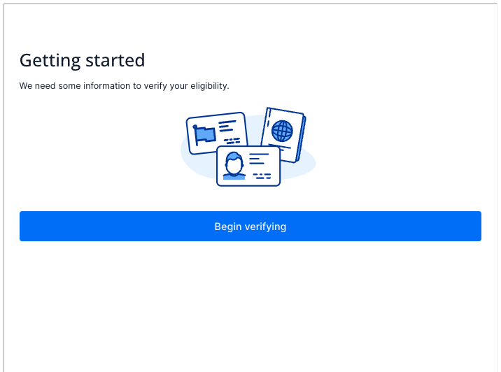

# Twilio KYC (Know Your Customer) Embed React App

The project shows how KYC Embed component can be used in a React Application that is deployed to Twilio Functions and embedded as an iframe into any web page.
This enables webpages that are not using the React framework or using an older version of React to embed the KYC Embed component.
The approach used is taken from [Chrome for Developers blog.](https://developer.chrome.com/blog/embed-content/)

## Step-by-step instructions

Before we can start building, you need to ensure you have a Twilio account. You can sign up for free using the link [here.](https://www.twilio.com/try-twilio)

### Developer environment setup
Make sure you have the software you need:

- [node.js](https://nodejs.org/) and [npm](https://docs.npmjs.com/downloading-and-installing-node-js-and-npm)
- [Twilio CLI](https://www.twilio.com/docs/twilio-cli/quickstart)
- [Twilio Serverless Toolkit](https://www.twilio.com/docs/labs/serverless-toolkit)

### Deploy functions
The next step is to deploy our code to Twilio Functions. To do this, execute the following command in the root of your project:
```shell
npm install
npm run deploy
```

Once deployment is complete, you will see the URLs of your newly created assets. Lookup in the list the URL of index.html page, it will look like the following:
```shell
Assets:
...
https://kyc-embed-react-app-XXXX-dev.twil.io/index.html
...
```

You can open the URL now, it should show a loading indicator and nothing else, this is expected and means that our react app is up and running. Copy the URL – we are ready to move on to the next step.

### Run and Test

The next step is to create an inquiry.
Normally this would be done from backend, but for the purpose of this tutorial I will use cURL command:

```shell
curl -X POST 'https://trusthub.twilio.com/v1/ComplianceInquiries/Registration/RegulatoryCompliance/GB/Initialize'
--header 'Content-Type: application/x-www-form-urlencoded'
--data-urlencode 'PhoneNumberType=national'
--data-urlencode 'EndUserType=Business'
--data-urlencode 'IsIsvEmbed=true'
--data-urlencode 'NotificationEmail=test@twilio.com'
--data-urlencode 'StatusCallbackUrl=https://backend.com/webhook'
--data-urlencode 'BusinessIdentityType=isv_reseller_or_partner'
--data-urlencode 'FriendlyName=My Friendly Name'
--user MY_ACCOUNT_SID:MY_AUTH_TOKEN
```

This command will create an inquiry for a UK regulatory bundle, examples of other flows you will find in the [Implementaion Guide section](#implementation-guide).
Before you can execute the command, you need to replace MY_ACCOUNT_SID placeholders with your Twilio account SID and MY_AUTH_TOKEN with your Twilio account auth token, both can be found in the Twilio console.
Once updated, you can execute the command. The JSON response will look like this:

```shell
{
"url": "https://trusthub.twilio.com/v1/ComplianceInquiries/Registration/RegulatoryCompliance/GB/Initialize",
"registration_id": "tri1.us1.account.ACXXXXXXXXXX.registration.BUXXXXXXXXXX",
"inquiry_session_token": "XXXXXXXXXXXXXXXXXXXXXXXXXXXXXX",
"inquiry_id": "XXXXXXXXXXXXXXXXXXXXXXXXXXXXXX"
}
```

Copy inquiry_session_token and inquiry_id, you will need them for the next step, namely to update the static page, the one that emulates our parent page - your website.
There are a couple of things to be updated, so first open the file public/static-page.html in a text editor and update the line 9 using the URL copied from the previous step.

```html
...
<iframe width='100%' height='800px' id="myIframe" src="https://kyc-embed-react-app-XXX-dev.twil.io/index.html"></iframe>
...
```

Then go to lines 16 and 17 and update values of inquire id and inquiry session token, you have copied them before:

```javascript
...
iframe.contentWindow.postMessage({
    inquiryId: XXXXXXXXXXXXXXXXXXXXXXXXXXXXXX,
    inquirySessionToken: 'XXXXXXXXXXXXXXXXXXXXXXXXXXXXXX',
}, '*')
...
```

Once updated, you can save the page and open it in your browser, you should see the Getting Started screen, one like below.
This means that everything worked, and you successfully embedded the Twilio KYC component into an external page.



## Implementation guide

For detailed and up-to-date information about KYC Embed API please refer to [Implementation Guide here.](https://docs.google.com/document/d/e/2PACX-1vRjNlWTZCRxLw43EjY18uSX_63KPPYCU-1cw1EebbE0sBs6rZYUvVFN7Fem22VX6ODWEPbdkhbKC8Rx/pub)


## Important files

This project was bootstrapped with [Create React App](https://github.com/facebook/create-react-app).\
Below you will find list of important files:

- [KycEmbedComponent.tsx](src%2FKycEmbedComponent.tsx) is a custom React wrapper for the Twilio KYC Embed component, designed to facilitate integration within your application. Its key functionalities include:

  1. **Message Listening**: It employs `window.addEventListener('message', ...)` to capture messages from the parent webpage, enabling passing the `inquiryId` and `inquirySessionToken` from the parent.
  2. **Status Forwarding**: The component relays status updates from the KYC verification process back to the parent webpage using `window.parent.postMessage(...)`, ensuring the parent is informed of the verification status outcome.

  This setup is crucial for a responsive and interactive KYC verification process within embedded environments.

- [static-page.html](public%2Fstatic-page.html) demonstrates embedding the deployed KYC Embed component within an external webpage using an iframe.
It includes code to securely send the 'inquiry id' and 'session token' to the embedded component through `iframe.contentWindow.postMessage(...)`.
Additionally, it listens for messages from the embedded component, ensuring seamless communication between the parent page and the iframe.
The 'inquiry id' and 'session token' can be obtained via the Twilio API, as illustrated in the provided [requests.http](http%2Frequests.http) sample request. 

- [twilio-compliance-embed-v0.1.0.tgz](twilio-compliance-embed-v0.1.0.tgz) is Twilio KYC Embed client package, check Twilio documentation for the latest version.

- [requests.http](http%2Frequests.http) has a sample request to get inquiry id and session token.

- [package.json](package.json) we intentionally moved all the dependencies to `devDependencies` to avoid limit on the size of dependencies on Twilio Functions. 

## Available Scripts

In the project directory, you can run:

### `npm start`

Runs the app in the development mode.\
Open [http://localhost:3000](http://localhost:3000) to view it in the browser.

The page will reload if you make edits.\
You will also see any lint errors in the console.

### `npm test`

Launches the test runner in the interactive watch mode.\
See the section about [running tests](https://facebook.github.io/create-react-app/docs/running-tests) for more information.

### `npm run build`

Builds the app for production to the `build` folder.\
It correctly bundles React in production mode and optimizes the build for the best performance.

The build is minified and the filenames include the hashes.\
Your app is ready to be deployed!

See the section about [deployment](https://facebook.github.io/create-react-app/docs/deployment) for more information.

### `npm run deploy`

Deploys the built files to Twilio functions.
The output of the command will contain URL of the index.html page that you should use as iframe URL.
The URL looks like:
```
https://kyc-embed-react-app-4466-dev.twil.io/index.html
```

## Disclaimer
The project is published as-is as sample code.
